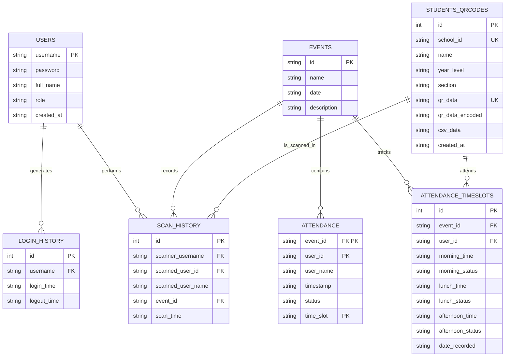

## Entity Relationship Legend

### Symbols
- `||` = One
- `o{` = Zero or more
- `||--o{` = One-to-Many relationship

### Notation
- **PK** = Primary Key (unique identifier)
- **FK** = Foreign Key (references another table)
- **UK** = Unique Key (must be unique, but not primary key)

## Relationships Explained

| From | To | Relationship | Meaning |
|------|-----|--------------|---------|
| USERS | LOGIN_HISTORY | 1:N | One user can have many login sessions |
| USERS | SCAN_HISTORY | 1:N | One user (scanner) can perform many scans |
| EVENTS | ATTENDANCE | 1:N | One event can have many attendance records |
| EVENTS | SCAN_HISTORY | 1:N | One event can have many scans recorded |
| EVENTS | ATTENDANCE_TIMESLOTS | 1:N | One event tracks multiple students |
| STUDENTS_QRCODES | SCAN_HISTORY | 1:N | One student can be scanned multiple times |
| STUDENTS_QRCODES | ATTENDANCE_TIMESLOTS | 1:N | One student has records per event |

## Quick Summary

**Core Tables (3)**
- USERS: User accounts and authentication
- EVENTS: Attendance events
- STUDENTS_QRCODES: Student records with QR codes

**Attendance Tables (2)**
- ATTENDANCE: Legacy attendance records
- ATTENDANCE_TIMESLOTS: New structure with morning/lunch/afternoon support

**Audit Tables (2)**
- LOGIN_HISTORY: User session tracking
- SCAN_HISTORY: Complete scan audit trail

