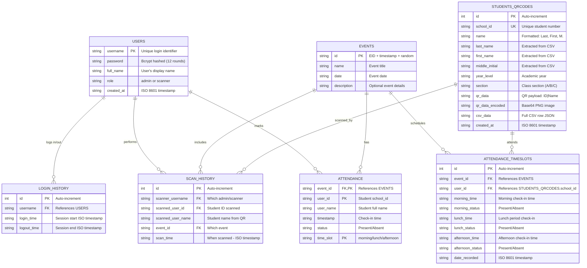

# QR Attendance Checker - Entity Relationship Diagram

## 📊 Database Architecture

### Table Overview

| Table | Purpose | Records | Key Feature |
|-------|---------|---------|------------|
| **USERS** | Authentication & Authorization | ~50-100 | Bcrypt password hashing |
| **EVENTS** | Attendance sessions | ~100-200 | Time-slot based tracking |
| **STUDENTS_QRCODES** | Student QR codes | ~5000+ | Structured name extraction |
| **ATTENDANCE_TIMESLOTS** | Multi-period attendance | ~10,000+ | Morning/Lunch/Afternoon support |
| **LOGIN_HISTORY** | Audit trail - logins | ~10,000+ | Session tracking |
| **SCAN_HISTORY** | Audit trail - scans | ~50,000+ | Complete scan audit log |
| **ATTENDANCE** | Legacy attendance | ~10,000+ | Backward compatible |

### 🔑 Key Design Features

**1. Security**
- Passwords hashed with Bcrypt (12 rounds)
- Unique usernames for authentication
- Role-based access control (admin/scanner)
- Complete audit trails for compliance

**2. Attendance Flexibility**
- Multi-time-slot support (morning/lunch/afternoon)
- Handles students checking in multiple times per day
- Backward compatible with legacy attendance table

**3. Student Data**
- Structured name fields (last_name, first_name, middle_initial)
- Unique school_id prevents duplicates
- QR code data stored as both raw and Base64 encoded
- Full CSV data preserved for reference

**4. Audit & Compliance**
- LOGIN_HISTORY tracks user sessions
- SCAN_HISTORY records who scanned whom and when
- Timestamps in ISO 8601 format for consistency
- Complete activity trail for investigations

## 🔗 Relationship Rules

| Relationship | Rule | Example |
|-------------|------|---------|
| USERS → LOGIN_HISTORY | 1:N | One admin can have 100s of login sessions |
| USERS → SCAN_HISTORY | 1:N | One scanner performs 1000s of scans |
| EVENTS → ATTENDANCE_TIMESLOTS | 1:N | One event tracks 1000s of students |
| EVENTS → SCAN_HISTORY | 1:N | One event captures 1000s of scans |
| STUDENTS_QRCODES → ATTENDANCE_TIMESLOTS | 1:N | Student attends multiple events & sessions |
| STUDENTS_QRCODES → SCAN_HISTORY | 1:N | Student scanned multiple times |

## 📈 Growth Capacity

With proper indexing:
- **Users**: 10,000+
- **Events**: 10,000+
- **Students**: 100,000+
- **Attendance Records**: 1,000,000+
- **Scan History**: 10,000,000+

## 🚀 Advanced Features

✅ **Real-time Sync**: Polling-based sync between multiple devices (2-second intervals)  
✅ **Multi-device Support**: API server enables network-based deployment  
✅ **PDF Export**: Attendance reports grouped by section  
✅ **QR Code Generation**: Batch QR generation from CSV upload  
✅ **Activity Logging**: Complete audit trail for admin review

